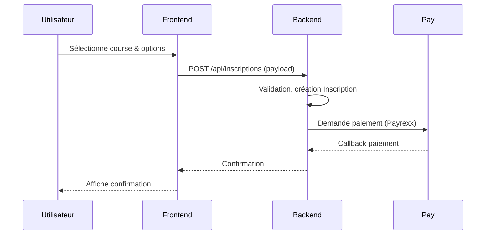
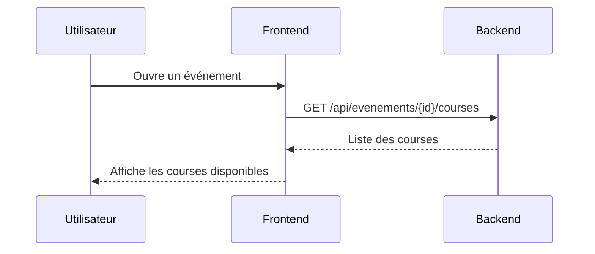
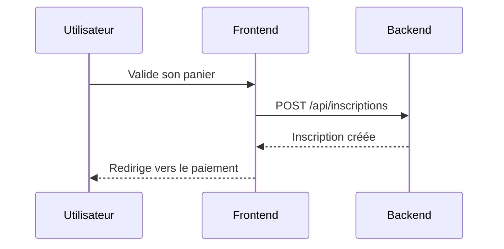
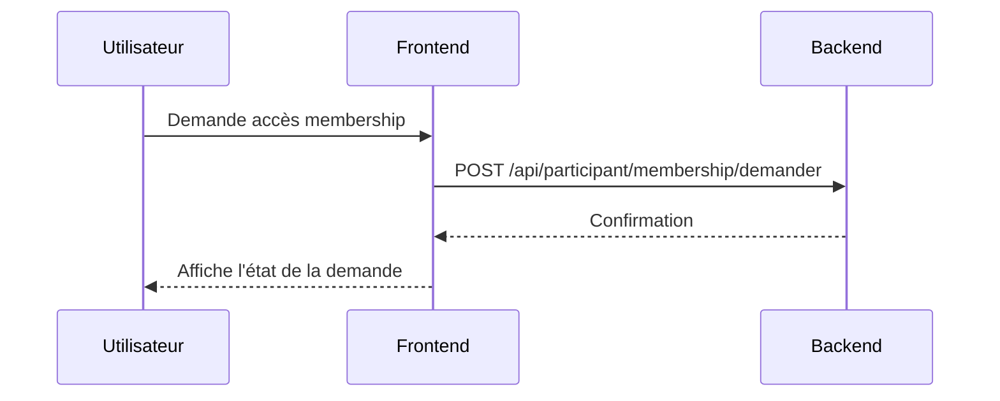
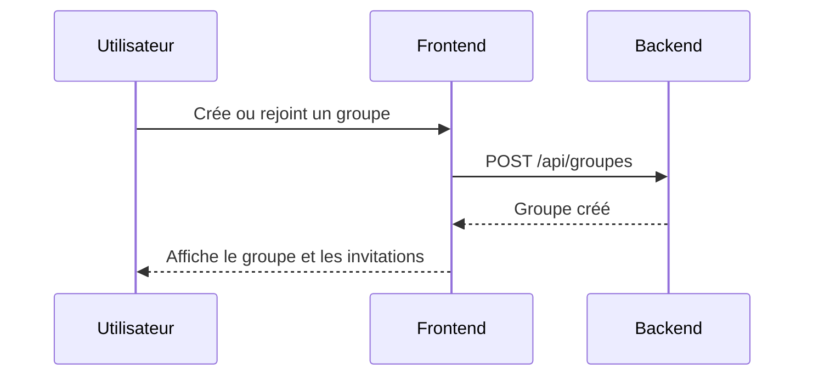
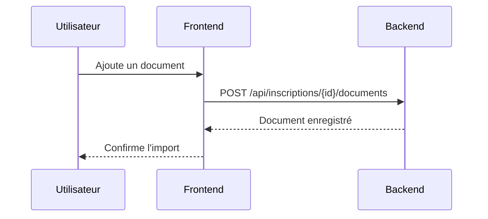
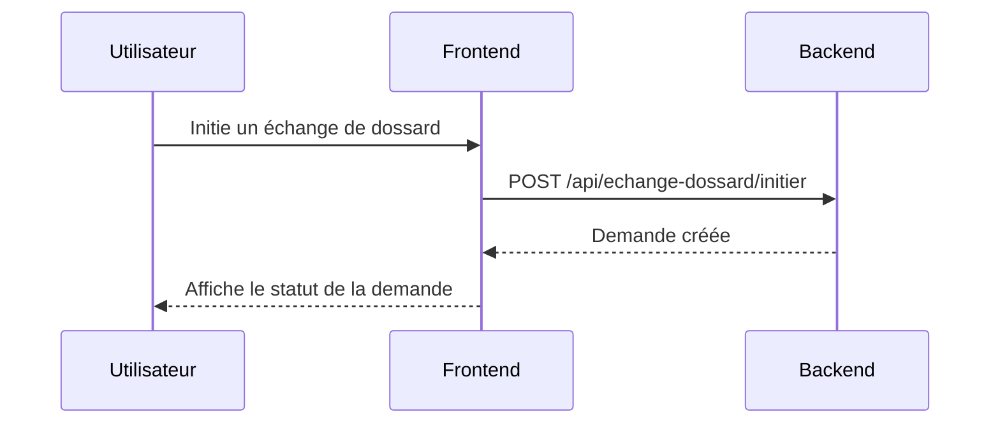
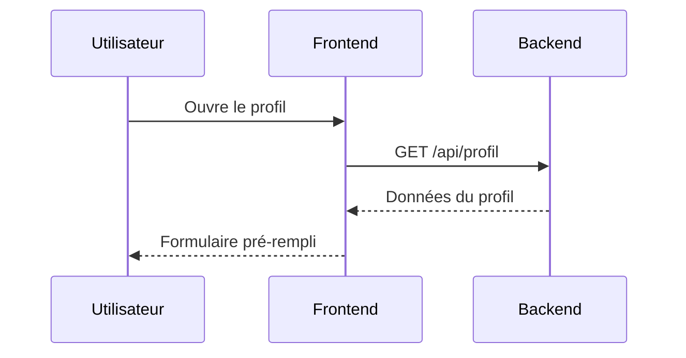
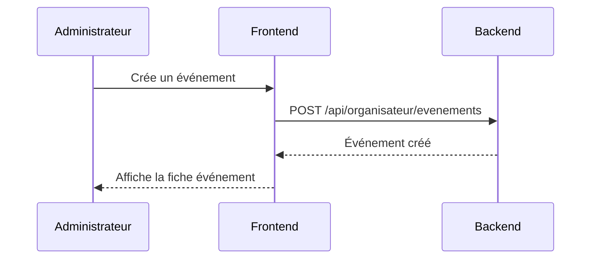

# Guide technique

Running Geneva

Guide technique

Projet: [render-test-app-laravel](https://github.com/AbsentMist/render-test-app-laravel)

Date: 28 mai 2026


<div class="page"></div>


## Table des matières

1. Contexte du POC
2. Prérequis techniques (résumé)
3. Architecture générale
4. Environnement de développement (synopsis)
5. Configuration du projet (indication)
6. Démarrage et exécution locale (commandes indicatives)
7. Fiches fonctionnalité
   - 7.1 Événements & Courses
   - 7.2 Inscriptions & Panier
   - 7.3 Membership
   - 7.4 Groupes & Invitations
   - 7.5 Documents
   - 7.6 Échange de dossard
   - 7.7 Résultats & Profil
   - 7.8 Pages organisateur
8. Backend : controllers, validation et patterns
9. Routes, payloads et exemples d'API
10. Tests & Qualité
11. Déploiement & Production
12. Maintenance & Évolution


<div class="page"></div>

### 1. Contexte du POC

Running Geneva est une preuve de concept (POC) d'une plateforme de gestion d'événements de course. L'objectif technique est de valider les parcours clefs participant / organisateur, la séparation frontend/backend et la viabilité d'un déploiement moderne (Vite + Laravel).

### 2. Prérequis techniques (résumé)

- PHP 8.2+, Composer
- Node.js 18+ et npm, Vite
- MariaDB/MySQL, Git
- Un navigateur récent

Pour les instructions d'installation détaillées voir le `README.md` à la racine; ci-dessous un rappel indicatif.

### 3. Architecture générale

- Backend: Laravel 12 — API REST, validation, persistance, exports
- Frontend: Vue 3 + Vite — SPA, Pinia (state), Vue Router (routes)
- Base de données: MariaDB / MySQL
- Authentification: Laravel Sanctum (sessions et tokens)

Responsabilités détaillées
- Backend: implémente la logique métier, persistance, exports CSV/XLSX, endpoints JSON, validation centralisée (FormRequest), notifications côté serveur.
- Frontend: navigation et UI, composition des appels API, orchestration des workflows (inscription, membership, échanges), gestion du cache local si nécessaire.

Sécurité et accès
- Auth via Sanctum; les routes organisateur/administration sont protégées par middleware (`is_admin`, `is_organizer`).
- Accès membership et règles spécifiques sont contrôlées via middleware/services côté backend.

Flux de données
- Frontend → Backend: appels JSON REST (POST/GET/PUT/DELETE). Les réponses utilisent une structure homogène (`status`, `message`, `data`) quand possible.
- Paiement: backend coordonne l'appel au provider (Payrexx) et gère les callbacks/notifications.


Flux global Participant



### 4. Environnement de développement (synopsis)

- Backend à la racine, frontend dans `resources/frontend`.
- Fichiers pivots: `composer.json`, `package.json`, `vite.config.js`, `routes/api.php`.
- Le `README.md` contient la procédure complète d'initialisation; ici on donne l'essentiel.

### 5. Configuration du projet (indication)

- Copier `.env.example` → `.env` et renseigner les variables (DB, APP_URL, PAYREXX_KEY, VITE_API_BASE_URL).
- Installer dépendances: `composer install` et `npm install` dans `resources/frontend`.

### 6. Démarrage et exécution locale (commandes indicatives)

Exemples rapides (voir `README.md` pour détails):

```bash
# à la racine
composer install
cp .env.example .env
php artisan key:generate
php artisan migrate --seed

# frontend
cd resources/frontend
npm install
npm run dev
```

Ces sections 4–6 sont volontairement succinctes: utiliser le `README.md` pour les procédures complètes.

<div class="page"></div>

## 7. Fiches fonctionnalité

Les fiches ci-dessous détaillent les parcours participant et organisateur.

### 7.1 Événements & Courses

Objectif

- Consulter les événements, afficher leurs courses et préparer l'inscription.

API (exemples)

- `GET /api/evenements` — liste des événements visibles
- `GET /api/evenements/{id}` — détail d'un événement
- `GET /api/evenements/{id}/courses` — courses associées à un événement

Frontend

- `Evenements.vue`
- `ListeCourses.vue`

Vue Evenements

Composants

- `Title`
- `MiniatureEvenement`

Méthodes principales côté vue

- `chargerEvenements()` : charge les événements affichés depuis l'API

Vue ListeCourses

Composants

- `Title`
- `MiniatureCourse`
- `PopupInscriptionCourse`

Méthodes principales côté vue

- `chargerParticipants()` : récupère les participants liés au compte
- `chargerDonnees()` : charge l'évènement et ses courses
- `ouvrirInscription(course)` : ouvre la popup d'inscription pour une course
- `gererAjoutPanier(donneesInscription)` : ajoute l'inscription préparée au panier

Séquence simplifiée



### 7.2 Inscriptions & Panier

Objectif

- Créer une inscription, gérer le panier et déclencher le paiement.

API (exemples)

- `POST /api/inscriptions` — crée une inscription
- `GET /api/inscriptions/{id}` — détail d'une inscription
- `PUT /api/inscriptions/{id}` — mise à jour d'une inscription

Requête exemple

```http
POST /api/inscriptions
Content-Type: application/json

{
  "course_id": 12,
  "participant_id": 34,
  "options": [{ "id": 5, "qty": 1 }]
}
```

Réponse exemple

```json
{
  "status": "ok",
  "data": { "id": 91, "etat": "pending_payment" }
}
```

Frontend

- `ParticipantInscriptions.vue`
- `Panier.vue`

Vue ParticipantInscriptions

Composants

- `Title`
- `Icon`
- `PopupAvertissementCourse`
- `PopupChangementCourseParticipant`
- `PopupInscriptionDetailParticipant`

Méthodes principales côté vue

- `chargerInscriptions()` : charge la liste des inscriptions du participant
- `changerTri(colonne)` : modifie le tri des colonnes
- `aUnEchangeEnCours(idInscription)` : indique si une inscription est bloquée par un échange
- `detailInscription(inscription)` : ouvre la fiche détaillée d'une inscription
- `fermerPopupChangement()` : ferme la popup de changement de course et recharge la liste

Vue Panier

Composants

- `PopupConfirmation`
- `Icon`

Méthodes principales côté vue

- `retirerArticle(idGroupe)` : retire un article du panier
- `ouvrirPopupInscription(message, redirection)` : affiche la confirmation finale
- `fermerPopupInscription()` : ferme la popup sans redirection
- `confirmerPopupInscription()` : valide la popup et redirige si nécessaire
- `coloriserLogosParier(panier)` : applique la couleur secondaire aux logos du panier
- `procederPaiement()` : valide les inscriptions et lance le paiement

Séquence simplifiée



### 7.3 Membership

Objectif

- Vérifier l'accès membership, soumettre une demande et suivre son statut.

API (exemples)

- `GET /api/participant/membership/acces` — vérifie l'accès
- `POST /api/participant/membership/demander` — soumet une demande
- `GET /api/organisateur/membership/demandes` — liste les demandes

Frontend

- `Membership.vue`
- `OrganisateurMembership.vue`

Vue Membership

Composants

- `Title`
- `Icon`

Méthodes principales côté vue

- `validerFormulaire()` : contrôle les champs obligatoires et les formats
- `soumettreDemande()` : ajoute le membership au panier puis redirige vers le paiement

Vue OrganisateurMembership

Composants

- `Title`
- `Icon`

Méthodes principales côté vue

- `chargerDemandes()` : charge les demandes membership
- `choisirStatus(status)` : filtre les demandes par statut
- `ouvrirDetail(demande)` : ouvre la fiche détaillée
- `rechercherParticipantInvitation()` : recherche un participant à inviter par email
- `selectionnerParticipantTrouve()` : sélectionne le participant trouvé pour l'invitation
- `creerInvitation()` : envoie une invitation membership
- `ouvrirApprouve(demande)` : prépare la validation d'une demande
- `approuverDemande()` : approuve la demande sélectionnée
- `ouvrirACompleter(demande)` : prépare la remise à compléter
- `remettreACompleterDemande()` : demande des compléments pour la demande sélectionnée
- `ouvrirAnnulerInvitation(demande)` : prépare l'annulation d'une invitation
- `annulerInvitation()` : annule l'invitation sélectionnée

Séquence simplifiée



### 7.4 Groupes & Invitations

Objectif

- Regrouper des participants; gérer invitations et rôles au sein d'un groupe.

API (exemples)

- `GET /api/groupes` — liste des groupes du participant
- `POST /api/groupes` — crée un groupe
- `POST /api/groupes/{id}/accepter` — accepte une invitation
- `POST /api/groupes/{id}/refuser` — refuse une invitation

Requête exemple

```http
POST /api/groupes
Content-Type: application/json

{
  "nom": "Team Geneva Runners",
  "description": "Groupe relais du POC"
}
```

Réponse exemple

```json
{
  "status": "ok",
  "data": { "id": 18, "nom": "Team Geneva Runners" }
}
```

Frontend

- `GroupListView`, `GroupDetail`, `InviteMemberDialog`

Composants de la vue

- `Title`
- `PopupGestionGroupe`

Méthodes principales côté vue

- `chargerGroupes()` : charge les groupes du participant
- `ouvrirGestionGroupe(groupe)` : ouvre la gestion d'un groupe
- `goToListeCourses(idEvenement)` : redirige vers les courses d'un événement

Séquence simplifiée



### 7.5 Documents

Objectif

- Mettre à disposition des documents par événement (règlements, itinéraires)

API (exemples)

- `GET /api/inscriptions/{id_inscription}/documents` — liste des documents liés à une inscription
- `POST /api/inscriptions/{id_inscription}/documents` — ajoute un document
- `GET /api/documents/{id}/download` — télécharge un document

Requête exemple

```http
POST /api/inscriptions/987/documents
Content-Type: multipart/form-data

file=<binary>
```

Réponse exemple

```json
{
  "status": "ok",
  "data": { "document_id": 301, "nom": "autorisation.pdf" }
}
```

Stockage

- fichiers stockés sur le système de fichiers ou un storage cloud; URLs publiques signées si nécessaires

Frontend

- `PopupInscriptionDetailParticipant.vue`
- `PopupInscriptionDetailOrganisateur.vue`

Vue détail participant

Composants

- `Icon`
- `PopupChangementCourseParticipant`
- `PopupConfirmation`

Méthodes principales côté vue

- `chargerDocumentsFournis()` : charge les documents liés à une inscription
- `telechargerDocument(doc)` : télécharge un document depuis l'API
- `supprimerDocument(idDoc)` : supprime un document côté participant
- `uploadDocument(fichier)` : envoie un document côté participant

Vue détail organisateur

Composants

- `Icon`
- `PopupChangementCourseOrganisateur`
- `PopupConfirmation`

Méthodes principales côté vue

- `chargerDocumentsFournis()` : charge les documents liés à une inscription
- `telechargerDocument(doc)` : télécharge un document depuis l'API
- `supprimerDocument(idDoc)` : supprime un document côté organisateur
- `uploadDocument(fichier)` : envoie un document côté organisateur

Séquence simplifiée



### 7.6 Échange de dossard

Objectif

- Permettre une demande d'échange/cession de dossard entre participants avec validation organisateur.

API (exemples)

- `GET /api/echange-dossard/mes-demandes-recues`
- `GET /api/echange-dossard/mes-demandes-envoyees`
- `POST /api/echange-dossard/initier` — crée la demande
- `POST /api/echange-dossard/{id}/accepter`
- `POST /api/echange-dossard/{id}/refuser`

Requête exemple

```http
POST /api/echange-dossard/initier
Content-Type: application/json

{
  "inscription_source_id": 987,
  "participant_cible_email": "alex@example.com",
  "message": "Souhait d'échanger le dossard"
}
```

Réponse exemple

```json
{
  "status": "ok",
  "data": { "echange_id": 77, "etat": "pending" }
}
```

Frontend

- `EchangeDossard.vue`

Composants

- `Title`
- `PopupConfirmation`
- `Icon`

Méthodes principales côté vue

- `chargerDonnees()` : charge les demandes reçues et envoyées ainsi que les inscriptions
- `echangeEnCoursPour(idInscription)` : vérifie si un échange est déjà en cours
- `initierEchange()` : envoie une demande d'échange de dossard
- `ouvrirPopupAccepter(demande)` : ouvre la confirmation d'acceptation
- `ouvrirPopupRefuser(demande)` : ouvre la confirmation de refus
- `ouvrirPopupAnnuler(demande)` : ouvre la confirmation d'annulation

Flux

- soumission -> validation interne -> notification -> mise à jour inscription

Séquence simplifiée



### 7.7 Résultats & Profil

Objectif

- Publier les résultats et permettre la gestion du profil utilisateur.

API (exemples)

- `GET /api/resultats` — résultats du participant connecté
- `GET /api/profil` — profil courant
- `PUT /api/profil` — met à jour le profil

Requête exemple

```http
PUT /api/profil
Content-Type: application/json

{
  "prenom": "Alex",
  "nom": "Martin",
  "email": "alex@example.com"
}
```

Réponse exemple

```json
{
  "status": "ok",
  "data": { "prenom": "Alex", "nom": "Martin", "email": "alex@example.com" }
}
```

Frontend

- `ResultsView`, `ProfileView`

Composants de la vue Résultats

- `Title`

Composants de la vue Profil

- `SelectNationalite`

Méthodes principales côté vue Résultats

- `chargerResultats()` : charge les résultats depuis l'API
- `getLogoSource(logo)` : normalise le logo pour l'affichage
- `getProgression(resultat)` : calcule la progression entre deux résultats
- `tempsToSecondes(temps)` : convertit un temps en secondes
- `secondesToTemps(sec)` : reformate une durée en texte lisible
- `formatTemps(temps)` : formate un temps pour l'affichage
- `formatDate(dateStr)` : formate une date ISO en format suisse
- `badgePosition(position)` : retourne la classe CSS du badge de classement

Méthodes principales côté vue Profil

- `chargerParticipants()` : charge les participants liés au compte
- `ouvrirEditionParticipant(p)` : prépare l'édition d'un participant
- `sauvegarderEditionParticipant()` : enregistre les modifications
- `confirmerSuppressionParticipant(p)` : prépare la suppression
- `supprimerParticipantConfirme()` : supprime le participant confirmé

Séquence simplifiée



### 7.8 Pages organisateur

Objectif

- Gestion des événements, export d'inscriptions, administration des formulaires.

API (exemples)

- `GET /api/organisateur/evenements`
- `POST /api/organisateur/evenements`
- `GET /api/organisateur/inscriptions`
- `GET /api/organisateur/inscriptions/export`

Requête exemple

```http
POST /api/organisateur/evenements
Content-Type: application/json

{
  "nom": "Running Geneva 2026",
  "date_debut": "2026-09-01",
  "date_fin": "2026-09-02"
}
```

Réponse exemple

```json
{
  "status": "ok",
  "data": { "id": 41, "nom": "Running Geneva 2026" }
}
```

Composants

- `OrganisateurEvenements.vue`, `OrganisateurCourses.vue`, `OrganisateurInscriptions.vue`, `OrganisateurMembership.vue`, `OrganisateurFormulaires.vue`

Composants de la vue Organisateur Evenements

- `Title`
- `PopupConfirmation`

Composants de la vue Organisateur Courses

- `Title`
- `PopupConfirmation`
- `PopupQuestionnaireResultat`
- `OptionList`
- `GestionCodesRabais`
- `GestionCodesDossard`
- `ImportResultats`

Composants de la vue Organisateur Inscriptions

- `Title`
- `FiltreInscriptions`
- `PopupAvertissementCourse`
- `PopupChangementCourseOrganisateur`
- `PopupInscriptionDetailOrganisateur`
- `PopupConfirmation`

Composants de la vue Organisateur Membership

- `Title`

Composants de la vue Organisateur Formulaires

- `Title`
- `FormulaireAvertissement`
- `FormulaireCategorie`
- `FormulaireCourse`
- `FormulaireEvenement`
- `FormulaireOnglet`
- `FormulaireOption`
- `FormulaireQuestion`
- `FormulaireTemplate`

Méthodes principales côté vue Organisateur Evenements

- `chargerEvenements()` : charge les événements administrables
- `toggleEpingler(evenement)` : épingle ou désépingle un événement
- `monterEvenement(indexGlobal)` / `descendreEvenement(indexGlobal)` : change l'ordre d'affichage
- `modifierEvenement(evenement)` : ouvre l'édition
- `confirmerSuppression(evenement)` / `supprimerEvenement()` : gestion de suppression

Méthodes principales côté vue Organisateur Courses

- `chargerCourses()` : charge les courses d'un événement
- `toggleOptionMenu(courseId)` : ouvre le menu d'actions d'une course
- `findCourseById(courseId)` : retrouve la course ciblée
- `modifierCourse(course)` : ouvre l'édition
- `supprimerCourse()` : supprime la course confirmée

Méthodes principales côté vue Organisateur Inscriptions

- `chargerInscriptions()` : charge la liste des inscriptions
- `onFiltresChange(nouveauxFiltres)` : met à jour les filtres
- `changerTri(colonne)` : modifie le tri du tableau
- `ouvrirDetailInscription(inscription)` : affiche la fiche d'une inscription
- `ouvrirChangementCourse(inscription)` : prépare un changement de course
- `ouvrirAvertissement(inscription)` : lance le panneau d'avertissement

Méthodes principales côté vue Organisateur Membership

- `chargerDemandes()` : charge les demandes membership
- `choisirStatus(status)` : applique un filtre de statut
- `handleOutsideClick()` : ferme les menus contextuels
- `approuverDemande(id)` : approuve une demande
- `remettreACompleterDemande(id)` : demande des compléments
- `annulerInvitation(id)` : annule une invitation

Méthodes principales côté vue Organisateur Formulaires

- `initModals()` : initialise les modales de la page
- `selectionnerOnglet()` : change l'onglet actif si nécessaire
- `ajouterEvenement()` / `modifierEvenement()` : gestion des formulaires événements
- `ajouterCourse()` / `modifierCourse()` : gestion des formulaires courses
- `ajouterQuestion()` / `modifierQuestion()` : gestion des formulaires questionnaires
- `ajouterOption()` / `modifierOption()` : gestion des options
- `ajouterTemplate()` / `modifierTemplate()` : gestion des templates

Séquence simplifiée




<div class="page"></div>

## 8. Backend : controllers, validation et patterns

Cette section formalise les controllers et les règles de validation à appliquer.

### Patterns observés

- Controllers centralisés (coordination), logique métier dans Services
- Requests pour validation des données (`FormRequest`)
- Resources pour formatage des réponses JSON

### Liste des controllers

- AuthController : `register`, `login`, `logout`, `me`, `updatePassword`, `rechercherParticipant`, `createInvitedUser`, `mesParticipants`, `creerParticipant`, `majParticipant`, `supprimerParticipant`, `mesNotificationsInfo`, `supprimerNotificationInfo`
- EvenementController : `indexAdmin`, `updateOrdre`, `indexParticipant`, `store`, `show`, `update`, `destroy`
- CourseController : `indexParticipant`, `indexAdmin`, `show`, `store`, `update`, `destroy`
- OptionController : `indexAdmin`, `indexParticipant`, `show`, `store`, `update`, `destroy`
- OptionPourCourseController : `indexAdmin`, `indexParticipant`, `show`, `store`, `destroy`, `destroyByCourse`
- QuestionController : `indexAdmin`, `indexParticipant`, `show`, `store`, `update`, `destroy`
- OptionQuestionController : `index`, `show`, `store`, `update`, `destroy`
- CourseQuestionController : `index`, `reordonner`
- ReponseQuestionController : `indexParInscription`, `indexParQuestion`, `store`, `destroy`
- GroupeController : `index`, `store`, `show`, `update`, `destroy`, `addParticipant`, `removeParticipant`, `verifierCodeEntreprise`, `getInvitations`, `accepterInvitation`, `refuserInvitation`
- InscriptionController : `indexAdmin`, `indexParticipant`, `store`, `show`, `updateAdmin`, `destroyAdmin`, `updateParticipant`, `destroyParticipant`, `exportAdmin`
- DocumentController : `indexByInscription`, `storeForInscription`, `storeForInscriptionAdmin`, `download`, `destroyParticipant`, `destroyAdmin`
- MembershipController : `accesParticipantMembership`, `rechercherParticipantParEmail`, `inviterParticipant`, `maDemande`, `soumettreDemande`, `listerDemandes`, `listerDemandesEnAttente`, `approuverDemande`, `remettreACompleterDemande`, `annulerInvitation`, `checkoutPayment`
- EchangeDossardController : `initier`, `mesDemandesRecues`, `mesDemandesEnvoyees`, `accepter`, `refuser`, `annuler`
- ResultatController : `mesResultats`, `indexParCourse`, `import`, `destroy`
- ProfileController : `show`, `update`
- CodeRabaisController : `index`, `store`, `update`, `destroy`, `valider`
- CodeDossardController : `index`, `store`, `update`, `destroy`, `valider`
- PrixEvolutifController : `index`, `store`, `update`, `destroy`, `destroyByCourse`, `tarifActuel`
- ChallengeOrganisationController : `index`, `store`, `destroy`
- TemplateController : `indexAdmin`, `store`, `show`, `update`, `destroy`
- AvertissementController : `indexAdmin`, `indexParticipant`, `store`, `show`, `update`, `destroy`
- CategorieController : `indexAdmin`, `indexParticipant`, `store`, `show`, `update`, `destroy`
- SousCategorieController : `indexAdmin`, `indexParticipant`, `store`, `show`, `update`, `destroy`
- ChoixOptionController : `indexParInscription`, `indexParOption`, `store`, `update`, `destroy`
- MessageController : `index`
- PayrexxController : `creerGateway`

### Erreurs et codes

- 400: requête mal formée, paramètres manquants ou incohérents
- 401: utilisateur non authentifié
- 403: action interdite malgré une authentification valide
- 404: ressource introuvable
- 409: conflit de données ou doublon métier
- 422: règles de validation non respectées
- 429: trop de requêtes ou limite atteinte
- 500: erreur serveur inattendue
- 503: service temporairement indisponible, maintenance ou dépendance externe en défaut
- En pratique, les réponses d'erreur suivent le format JSON de Laravel avec un message principal et, si besoin, une liste d'erreurs par champ.


<div class="page"></div>

## 9. Routes, payloads et exemples d'API

Synthèse rapide des endpoints les plus utilisés (voir `routes/api.php` pour la liste complète)

- Auth: `POST /api/register`, `POST /api/login`, `POST /api/logout`, `GET /api/me`
- Evenements/Courses: `GET /api/evenements`, `GET /api/evenements/{id}`, `GET /api/courses`
- Inscriptions/Panier: `POST /api/inscriptions`, `GET/POST /api/panier`, `POST /api/paiement` (Payrexx)
- Membership: `GET /api/participant/membership/acces`
- Groupes: `GET/POST /api/groupes`
- Documents: `GET/POST /api/documents`
- Echange dossard: `POST /api/echange-dossard`
- Resultats: `GET /api/resultats`
- Organisateur (prefix `/organisateur`): routes de gestion et exports


### 9.1 OpenAPI minimale

```yaml
openapi: 3.0.3
info:
  title: Running Geneva POC API
  version: 1.0.0
  description: Spécification OpenAPI minimale du POC Running Geneva.
servers:
  - url: https://example.com/api
paths:
  /register:
    post:
      summary: Créer un compte
      requestBody:
        required: true
        content:
          application/json:
            schema:
              type: object
              required: [name, email, password]
              properties:
                name: { type: string }
                email: { type: string, format: email }
                password: { type: string }
      responses:
        '200': { description: Compte créé }
  /login:
    post:
      summary: Se connecter
      responses:
        '200': { description: Authentifié }
  /me:
    get:
      summary: Profil du compte connecté
      security:
        - sanctum: []
      responses:
        '200': { description: Profil }
  /evenements:
    get:
      summary: Liste des événements
      security:
        - sanctum: []
      responses:
        '200': { description: Liste paginée }
  /evenements/{id}:
    get:
      summary: Détail d'un événement
      security:
        - sanctum: []
      parameters:
        - in: path
          name: id
          required: true
          schema: { type: integer }
      responses:
        '200': { description: Détail événement }
  /participant/evenements/{id_evenement}/courses:
    get:
      summary: Courses d'un événement côté participant
      security:
        - sanctum: []
      parameters:
        - in: path
          name: id_evenement
          required: true
          schema: { type: integer }
      responses:
        '200': { description: Courses }
  /inscriptions:
    post:
      summary: Créer une inscription
      security:
        - sanctum: []
      requestBody:
        required: true
        content:
          application/json:
            schema:
              type: object
      responses:
        '200': { description: Inscription créée }
  /participant/membership/acces:
    get:
      summary: Vérifier l'accès membership
      security:
        - sanctum: []
      responses:
        '200': { description: Etat d'accès }
  /participant/groupes:
    get:
      summary: Lister les groupes
      security:
        - sanctum: []
      responses:
        '200': { description: Groupes }
  /participant/echange-dossard/initier:
    post:
      summary: Initier un échange de dossard
      security:
        - sanctum: []
      responses:
        '200': { description: Demande créée }
  /participant/profil:
    get:
      summary: Consulter le profil
      security:
        - sanctum: []
      responses:
        '200': { description: Profil }
    put:
      summary: Mettre à jour le profil
      security:
        - sanctum: []
      responses:
        '200': { description: Profil mis à jour }
components:
  securitySchemes:
    sanctum:
      type: http
      scheme: bearer
      bearerFormat: token
```


<div class="page"></div>

## 10. Tests & Qualité

Recommandations et état actuel:

- Backend: PHPUnit (exemples d'exécution `php artisan test`)
- Frontend: `npm run test` (Vitest)
- Ajouter tests d'intégration pour les workflows de paiement

## 11. Déploiement & Production

À faire pour un déploiement en production :

- Modifier les variables d'environnement listées dans `.env` (DB, APP_URL, PAYREXX)
- Configurer le serveur SMTP pour le mailing
- Configurer la passerelle de paiement
- Synchroniser le build frontend: `npm run build` dans `resources/frontend`
- Synchroniser les données des migrations: `php artisan migrate --force`

## 12. Maintenance & Évolution

- Documenter chaque ajout de route ou modification de modèle
- Mettre à jour les fiches fonctionnalité correspondantes
- Garder des tests pour les parcours critiques


*Auteurs : Alessandro Neris, Jean-Daniel Guillermet, Rémi Perroud, Steven Ngoie* 
